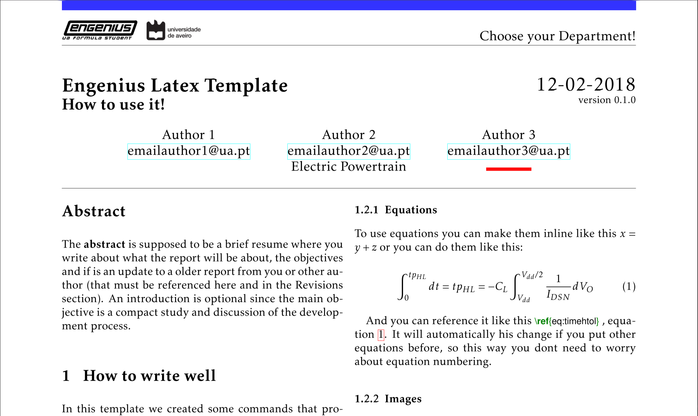

<p align="center"><a href="http://engeniusteam.web.ua.pt/" target="_blank"></a>
<a href="https://www.latex-project.org/" target="_blank"></a>
</p>

<p align="center">
<b>one-column:</b>
<a href="https://github.com/dvcorreia/engenius-ua-latex-template/releases/download/v0.1.0/engenius-ua-latex-template-one-column.zip">Download Template</a>
 ||
<a href="https://www.overleaf.com/latex/templates/engenius-latex-template/nzcqzfvmctkz#">Open with Overleaf</a>
</p>

<p align="center">
<b>two-column:</b>
<a href="https://github.com/dvcorreia/engenius-ua-latex-template/releases/download/v0.1.0/engenius-ua-latex-template-two-column.zip">Download Template</a>
 ||
<a href="https://www.overleaf.com/latex/templates/engenius-latex-template/nzcqzfvmctkz#">Open with Overleaf</a>
</p>

A custom Latex Document Class used by _Engenius_ at Aveiro's University. Was developed by [Diogo Correia](https://github.com/dvcorreia) and [João Santos](https://github.com/joaompsantos).
This template was created thinking about non LaTeX users, providing easy writing and functions for people without any knowledge about TeX or LaTeX.

## Preview

<p align="center">
    Check <b>.pdf</b> Template Examples
</p>

<p align="center">
<a href="./documentation-assets/engenius-ua-latex-one-column-template.pdf">One Column Template</a>
 ||
<a href="./documentation-assets/engenius-ua-latex-two-column-template.pdf">Two Column Template</a>
</p>

<a href=# target="_blank"></a>

</p>

## How to use the template

The most pratical way to learn how to use the template is by opening in your editor of preference the project template in this repo ou by creating a new project with the template in overleaf. In the template will be a step by step guide how to work with it.

### Abstract

The __abstract__ is supposed to be a brief resume where you write about what the report will be about and the objectives. If this document is an update to a older report from were you were not part of that must be referenced here and in the Revisions section in order to check the progress of the team through the years and give credit to the previous team members.

### Document Information

Before start writing you should complete the preamble with your information. Don't forget to insert your department identification in:`\documentclass[insert your department]{engenius}` 

+ __ec__ - Electronics and Communications Department
+ __epower__ - Powertrain Electric Department
+ __business__ - Business Department
+ __cpower__ - Powertrain Combustion Department
+ __svd__ - Suspension and vehicle dynamics Department
+ __chassis__ - Chassis develpment Department

Fill the __authors__ information and choose a common way of identifying your department. There are 3 options you can choose: not identifying at all, identifying as showed in Author2 in the preview image:

+ __depofec__ - Electronics and Communications Department
+ __depofepower__ - Powertrain Electric Department
+ __depofbusiness__ - Business Department
+ __depofcpower__ - Powertrain Combustion Department
+ __depofsvd__ - Suspension and vehicle dynamics Department
+ __depofchassis__ - Chassis develpment Department
 
 or with your department color and exemplified in Author3:

 + __depofeccolor__ - Electronics and Communications Department
+ __depofepowercolor__ - Powertrain Electric Department
+ __depofbusinesscolor__ - Business Department
+ __depofcpowercolor__ - Powertrain Combustion Department
+ __depofsvdcolor__ - Suspension and vehicle dynamics Department
+ __depofchassiscolor__ - Chassis develpment Department

Out preference is identifying with the name of your department, the second option.

__Versions__ are important since they can evaluate the progress of the work. A version is composed by 3 integers, `version N1.N2.N3`. `N1` increases when a complete modification of the previous work is implemented, `N2` increases when are made big changes in the current work, `N3` increases when small changes like updates are done or added.

### Writing sugestions

#### Equations

To use equations you can make them inline like this `$x = y + z$` or you can do them like this:

```latex
\begin{equation}\label{eq:timehtol}
    \int_{0}^{tp_{HL}}dt = tp_{HL} = -C_L \int_{V_{dd}}^{V_{dd}/2}\frac{1}{I_{DSN}} dV_O
\end{equation}
```

And you can reference it like this `equation~\ref{eq:timehtol}`. It will automatically change if you put other equations before, so this way you dont need to worry about numbering.

#### Images

Images are placed like the example bellow. You can tune the width to make it fit your needs, it can take any units (cm, in, em ...). To reference an image you can follow the same aproach as in equations: `image~\ref{img:engeniuslogo}`.

```latex
\begin{figure}[H]
    \begin{center}
        \includegraphics[width=\textwidth/3]{src/engeniusLogo.png}
        \caption{Engenius Image Example}
        \label{img:engeniuslogo}
    \end{center}
\end{figure}
```

#### Code

Raw code can be inserted inline like this `\mintinline{python}{print("Hello world!")}`, or in a box like the one bellow. Check our code to see how to do it.

```latex
\begin{codebox}{Example Code}
    \begin{minted}{C}
        #include <stdio.h>
        int main()
        {
           // printf() displays the string inside quotation
           printf("Hello, World!");
           return 0;
        }
    \end{minted}
\end{codebox}
```

#### References and Revision

References must be used when you use information from external fonts. There is no shame in referencing everything :sweat_smile: . Your bibliografy must be in the file `./biblio.bib` structured like the examples already there. 

To cite something just use `\cite{name}`, like this `\cite{einstein}`. The reference will then show in the references section.

The revision section is used to tell which report are you updating/revising in case you have one. This section exist in order to give __credits__ to the people that worked before you, they must not be forgotten :smile: . You also need to put in your document all revisions that were in the document you are updating and update the version according to specified above.

#### Questions, Bugs and Suggestions

We spent a good amount of time creating this template and we are open for collaborators and suggestions ❤️ .

If you find any bugs please let us know so we can fix then.

If you have any question or need help you can also contact us.
Check if your question was already been answered [here](https://github.com/dvcorreia/engenius-ua-latex-template/labels/question).

All of that can be done here in github's issues section, [here](https://github.com/dvcorreia/engenius-ua-latex-template/issues/new).

Thanks for using our template :car: .

## Contribution

Feel free to contribute and improve this template!

This template was inspired by the latex [template](http://code.ua.pt/projects/latex-ua) from Aveiro's University, following the same design rules.

Thank you to all the people who already [contributed](https://github.com/dvcorreia/engenius-ua-latex-template/graphs/contributors)!
